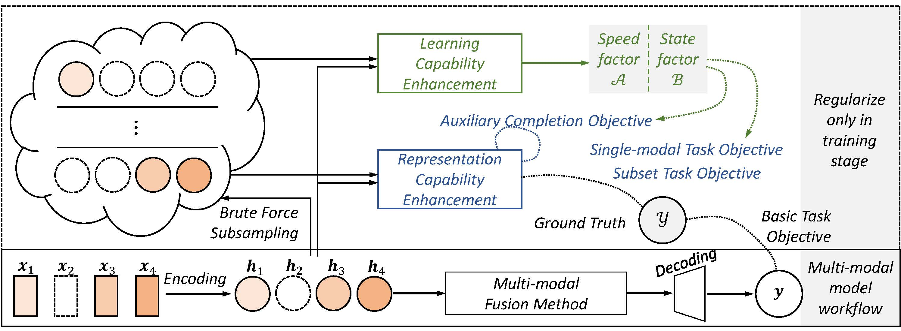

# MCE
MCE: Towards a General Framework for Handling Missing Modalities under Imbalanced Missing Rates [[DOI]]() [[Arxiv]]()

Accepted by **Pattern Recognition** in 2025


## Overview

**Abstract**: Multi-modal learning has made significant advances across diverse pattern recognition applications. However, handling missing modalities, especially under imbalanced missing rates, remains a major challenge. This imbalance triggers a vicious cycle: modalities with higher missing rates receive fewer updates, leading to inconsistent learning progress and representational degradation that further diminishes their contribution. Existing methods typically focus on global dataset-level balancing, often overlooking critical sample-level variations in modality utility and the underlying issue of degraded feature quality. We propose Modality Capability Enhancement (MCE) to tackle these limitations. MCE includes two synergistic components: i) Learning Capability Enhancement (LCE), which introduces multi-level factors to dynamically balance modality-specific learning progress, and ii) Representation Capability Enhancement (RCE), which improves feature semantics and robustness through subset prediction and cross-modal completion tasks. Comprehensive evaluations on four multi-modal benchmarks show that MCE consistently outperforms state-of-the-art methods under various missing configurations.


## Updates
- 2025/10/11 Create project. Support MCE on nuScenes dataset. 


## Dataset Support
  - [x] nuScenes
  - [ ] BraTS2020
  - [x] IEMOCAP
  - [x] AudiovisionMNIST

## Quick Start
### 1. nuScenes
##### Download dataset
```
mkdir nuScenes
```
First, you need to download raw data from [nuScenes](https://www.nuscenes.org/) to the created path `/nuScenes`.

##### Install and Train
Please refer to the [simple_bev/README.md](./simple_bev/README.md) for detailed documentations.


### 2. IEMOCAP
##### Download dataset
##### Install
##### Train&Test

### 3. AudiovisionMNIST
##### Download dataset
##### Install
##### Train&Test 


## Citation
If you are using our project for your research, please cite the following paper:

```
Coming soon...
```

or

```
Coming soon...
```

## Acknowledgements
Thank for the project supported by [simple-bev](https://github.com/aharley/simple_bev), [RASSION](https://github.com/Jun-Jie-Shi/PASSION), [RedCore](https://github.com/sunjunaimer/RedCore) and [SMIL](https://github.com/deep-real/SMIL).
